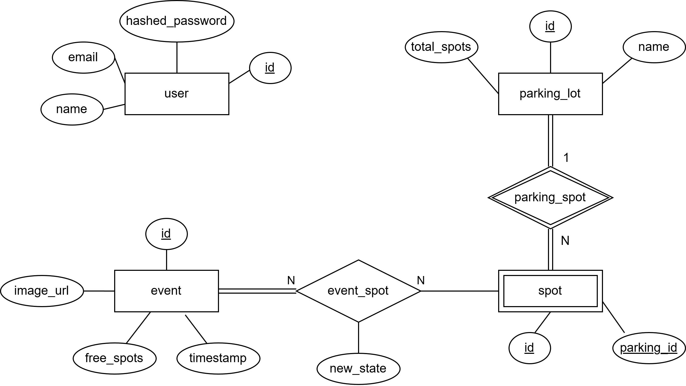

# **Índice**
- [**Índice**](#índice)
- [**Glosario**](#glosario)
- [**Mapa del sistema**](#mapa-del-sistema)
- [**Contratos de datos**](#contratos-de-datos)
  - [Raspberry Pi → IoT Core → SQS → Cloud Receptor](#raspberry-pi--iot-core--sqs--cloud-receptor)
    - [Notas](#notas)
    - [Payload](#payload)
  - [Websocket API → Frontend](#websocket-api--frontend)
    - [Notas](#notas-1)
    - [Payload](#payload-1)
  - [Frontend → Websocket API](#frontend--websocket-api)
    - [Notas](#notas-2)
    - [Payload](#payload-2)
    - [Respuesta](#respuesta)
  - [Websocket API → Cloud Receptor → IoT Core → Raspberry Pi](#websocket-api--cloud-receptor--iot-core--raspberry-pi)
    - [Notas](#notas-3)
    - [Payload](#payload-3)
  - [REST API: Endpoint /api/signup](#rest-api-endpoint-apisignup)
    - [Notas](#notas-4)
    - [Response 200 OK](#response-200-ok)
    - [Response 409 | 400 | 500](#response-409--400--500)
  - [REST API: Endpoint /api/login](#rest-api-endpoint-apilogin)
    - [Notas](#notas-5)
    - [Response 200 OK](#response-200-ok-1)
    - [Response 401 | 400 | 500](#response-401--400--500)
  - [REST API: Endpoint /api/events](#rest-api-endpoint-apievents)
    - [Notas](#notas-6)
    - [Response 200 OK](#response-200-ok-2)
    - [Response 401 | 400 | 500](#response-401--400--500-1)
  - [REST API: Endpoint /api/stats/(?)](#rest-api-endpoint-apistats)
    - [Notas](#notas-7)
    - [Response 200 OK](#response-200-ok-3)
- [**Esquemas**](#esquemas)
  - [PostgreSQL](#postgresql)
    - [Diagrama entidad-relación](#diagrama-entidad-relación)
    - [Esquema UML](#esquema-uml)
  - [Redis](#redis)
    - [Forma de los datos](#forma-de-los-datos)
    - [Escritura en Redis](#escritura-en-redis)
    - [Lectura en Redis](#lectura-en-redis)


# **Glosario**
| Término | Definición |
| ----- | ----- |
|  |  |
| Lugar / Spot | Un lugar físico único del estacionamiento, identificado por un ID único. |
| Estado de un lugar / Spot status | 0 o 1, para libre y ocupado respectivamente. |
| Estado (del estacionamiento) / State | Conjunto de los estados de todos los lugares del estacionamiento. |
| Actualización de estado / State update | Mensaje enviado por el Pi, conteniendo el estado del estacionamiento y otros datos relevantes, cuando algún lugar puntual cambia su estado. |
| Confianza / Confidence | Un float en el intervalo 0.0,1.0 que representa la certeza que tiene el sistema sobre el estado de un lugar determinado. |
| Evento | Un registro almacenado de una actualización de estado recibida. |

# **Mapa del sistema**


# **Contratos de datos**

## Raspberry Pi → IoT Core → SQS → Cloud Receptor

### Notas

* Objetivo: Comunicar una actualización de estado al backend.  
* Protocolo: MQTT (Pi → IoT Core), IoT Core Rule (IoT Core → SQS), HTTPS  
* Topic: parking/state\_update  
* Restricción de tamaño: IoT Core impone un límite de transmisión de 128Kb.

### Payload
```
{
  "device_id": "string",
  "parking_id": "string",
  "parking_name": "string",
  "timestamp": "ISO 8601 UTC string",
  "seq": "integer",
  "snapshot": "byte[]",
  "total_spots": "integer",
  "free_spots": "integer",
  "spots": [
    {
      "spot_id": "string",
      "status": "0 | 1",
      "confidence": "float 0.0-1.0",
      "last_changed": "ISO 8601 UTC string"
    }
  ]
}
```

* "timestamp" es el momento en el que el Raspberry Pi captura la imagen, no el momento en el que la envía.  
* Si un lugar cambia su estado en esta transmisión, el "last\_changed" de ese lugar debe ser igual a "timestamp".  
* "status" es 0 si el lugar está libre y 1 si está ocupado.  
* "seq" es un número de secuencia incremental.

## Websocket API → Frontend

### Notas

* Objetivo: Comunicar actualizaciones de estado a los usuarios actualmente conectados.  
* Protocolo: Websocket (HTTPS para establecer la conexión, luego TCP).  
* Endpoint: wss://nuestra-url/ws

### Payload
```
{
  "type": "STATE_UPDATE | INITIAL_STATE",
  "parking_id": "string",
  "parking_name": "string",
  "timestamp": "ISO 8601 UTC string",
  "spots": [
    { "spot_id": "string", "status": "0 | 1" }
  ]
}
```
* "type" solo será "INITIAL\_STATE" en la comunicación HTTPS inicial que establece la conexión

## Frontend → Websocket API

### Notas

* Objetivo: Comandar la captura de una foto actual.  
* Protocolo: Websocket (HTTPS para establecer la conexión, luego TCP). 

### Payload
```
{
  "accessToken": "jwt_access_token",
  "action": "TAKE_PHOTO",
  "parking_id": "string"
}
```

### Respuesta
```
{
  "data": "byte[]",
  "status": "ok | string",
}
```
* “status” será el mensaje de error en caso de que algo falle.

## Websocket API → Cloud Receptor → IoT Core → Raspberry Pi

### Notas

* Objetivo: Redireccionar la petición de una foto hasta el Raspberry Pi.  
* Protocolo: Function call (Websocket API → Cloud Receptor), No se (Cloud Receptor → IoT Core), MQTT (IoT Core → Raspberry Pi).

### Payload
```
{
  "action": "TAKE_PHOTO",
  "parking_id": "string",
  "requestId": "UUID"
}
```
* “requestId” es generado y almacenado en memoria por API Websockets para tener registro de cada cliente simultáneo.

## REST API: Endpoint /api/signup

### Notas

* Objetivo: Registrarse.  
* POST  
*  Query params:  
  * email  
  * password  
  * name  
* Posibles respuestas:  
  * 200 OK  
  * 409 Conflict  
  * 400 Bad request \- Query params faltantes o en mal formato  
  * 500 Internal server error

### Response 200 OK
```
{
  "user": {
    "id": "integer",
    "email": "string"
  },
  "accessToken": "jwt_access_token"
}
```
### Response 409 | 400 | 500
```
{
  "error": "string"
}
```
## REST API: Endpoint /api/login

### Notas

* Objetivo: Iniciar sesión.  
*  Query params:  
  * email  
  * password  
* Posibles respuestas:  
  * 200 OK  
  * 401 Unauthorized  
  * 400 Bad request \- Query params faltantes o en mal formato  
  * 500 Internal server error

### Response 200 OK
```
{
  "accessToken": "jwt_access_token",
  "user": {
    "id": "integer",
    "email": "string"
  }
}
```
### Response 401 | 400 | 500
```
{
  "error": "string"
}
```
## REST API: Endpoint /api/events

### Notas

* Objetivo: Pedir eventos pasados.  
*  Query params:  
  * from \- datetime, obligatorio  
  * to \- datetime, obligatorio  
  * limit \- integer, opcional, default 20  
  * page  \- integer, opcional, default 1  
* Posibles respuestas  
  * 200 OK  
  * 400 Bad Request \- Query params faltantes o en mal formato  
  * 500 Internal server error

### Header
```
  "authorization": "bearer 'jwt_access_token'"
```

### Response 200 OK
```
{
  "total_events": "integer",
  "events": [
    {
      "id": "integer",
      "pi_timestamp": "ISO 8601 UTC string",
      "free_spots": "integer",
      "total_spots": "integer",
      "image_url": "string",
      "spots": [
        { "spot_id": "string", "status": "0 | 1" }
      ]
    }
  ]
}
```
* "total_events" es la cantidad total de eventos registrados entre from  y to.

### Response 401 | 400 | 500
```
{
      "error": "string"
}
```

## REST API: Endpoint /api/stats/(?)

### Notas

* Objetivo: Pedir estadísticas.  
*  

### Response 200 OK

WIP


# **Esquemas**
## PostgreSQL

### Diagrama entidad-relación


### Esquema UML


## Redis

Redis puede almacenar hashes como par key:value, strings, y conjuntos ordenados o no ordenados. Nosotros vamos a usar un string para almacenar un JSON serializado en parking\_lot:{parking\_id}:state.

### Forma de los datos
```
{
  "parking_id": "string",
  "parking_name": "string",
  "timestamp": "ISO 8601 UTC string",
  "spots": [
    { "spot_id": "string", "status": "0 | 1" }
  ]
}
```
### Escritura en Redis
```
import json, redis
redis.Redis(host=REDIS_HOST)
state
{
        "parking_id": event.parking_id,
            "parking_name": event.parking_name,
                "timestamp": event.timestamp,
                    "spots": { s.spot_id: s.status for s in event.spots }
}
r.set(f"parking_lot:{event.parking_id}:state", json.dumps(state))
```
### Lectura en Redis

```
raw = r.get(f"parking_lot:{parking_id}:state")

if raw is None:
    state = query_latest_event_from_postgres(parking_id)
    r.set(f"parking_lot:{parking_id}:state", json.dumps(state))
else:
    state = json.loads(raw)
send_to_client({"type": "INITIAL_STATE", **state})
```
